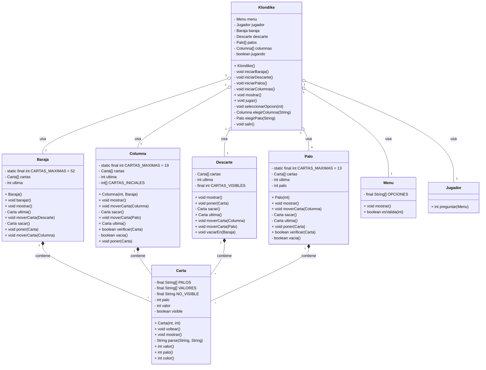

# Diagrama Mermaid del Proyecto Klondike



```mermaid
sequenceDiagram
    participant J as Jugador
    participant K as Klondike
    participant M as Menu
    participant B as Baraja
    participant D as Descarte
    participant C as Columna
    participant P as Palo

    J->>K: iniciar juego
    K->>B: iniciarBaraja()
    K->>D: iniciarDescarte()
    K->>P: iniciarPalos()
    K->>C: iniciarColumnas()
    loop mientras jugando
        K->>M: mostrar opciones
        M->>J: mostrar menú
        J->>K: seleccionar opción
        alt opción 1
            K->>B: moverCarta a Descarte
        else opción 2
            K->>D: moverCarta a Palo
        else opción 3
            K->>D: moverCarta a Columna
        else opción 4
            K->>P: moverCarta a Columna
        else opción 5
            K->>C: moverCarta a Palo
        else opción 6
            K->>C: moverCarta a Columna
        else opción 7
            K->>C: voltear carta
        else opción 8
            K->>D: vaciarEn Baraja
        else opción 9
            K->>K: salir()
        end
        K->>K: mostrar estado
    end